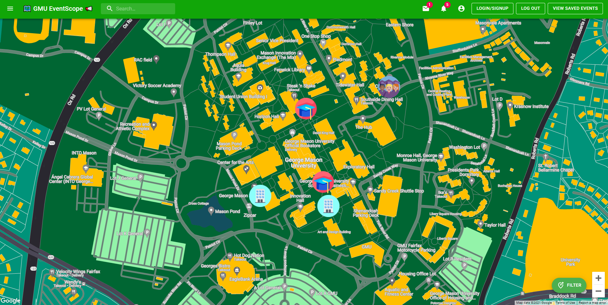

<h1 align="center">
	
</h1>

<h3 align="center">
	EventScope
</h3>

<p align="center">
	<strong>
		<a href="">Website</a>
		•
		<a href="">Docs</a>
		•
		<a href="">Demo</a>
	</strong>
</p>
<!-- <p align="center">
	<a href="https://demo.thelounge.chat/"></a>
	<a href="https://yarn.pm/thelounge"></a>
	<a href="https://github.com/thelounge/thelounge/actions"></a>
	<a href="https://npm-stat.com/charts.html?package=thelounge&from=2016-02-12"></a>
</p> -->

<p align="center">
	
</p>

## Overview

- **Todo** todo
- **Todo** todo
- **Todo** todo
- **Todo** todo


To learn more about configuration, usage and features of EventScope, take a look at [the website](https://).

## Installation and usage

The Lounge requires latest [Node.js](https://nodejs.org/) LTS version or more recent.
[Yarn package manager](https://yarnpkg.com/) is also recommended.  

### Running from source

The following commands install and run the development version of The Lounge:

```sh
git clone https://github.com/GMU-EventScope/master.git
cd master
npm install
npm start
```

⚠️ While it is the most recent codebase, this is not production-ready! Run at
your own risk. It is also not recommended to run this as root.

## Development setup

Simply follow the instructions to run Eventscope from source above, on your own
fork.

Before submitting any change, make sure to:

- Read the [Contributing instructions](https://github.com/thelounge/thelounge/blob/master/.github/CONTRIBUTING.md#contributing)
- Run `npm test` to execute linters and test suite
- Run `npm build` if you change or add anything in `src/contexts` or `src/components`
- `npm dev` can be used to start EventScope with hot module reloading

## License

Distributed under the MIT License. See `LICENSE` for more information.